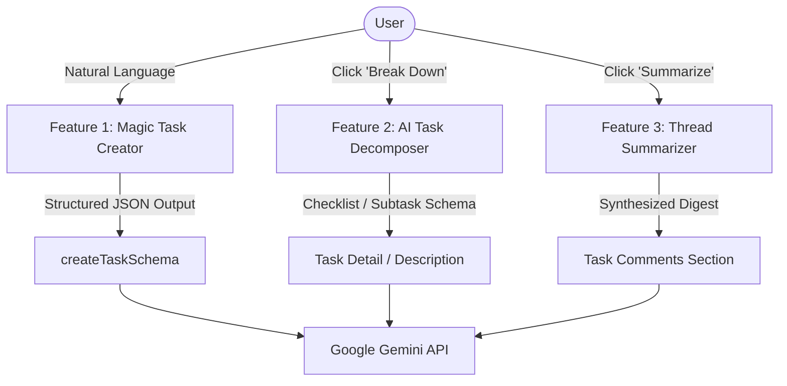

# Product Requirements Document (PRD)
## Gemini AI-Powered Features for Kanban Task Board

**Document Version:** 1.0.0  
**Status:** Approved for Implementation  
**Target Environment:** Next.js 16 (App Router), PostgreSQL + Prisma ORM, Auth.js, Tailwind CSS, TypeScript Strict Mode  
**AI Foundation:** Google Gemini API (`gemini-2.5-flash` / `@google/genai`)  

---

## 1. Executive Summary

This PRD outlines the integration of three high-impact, generative AI capabilities into the **Kanban Task Board (`k-dash`)** using the Google Gemini API. These features eliminate friction in task creation, streamline complex project breakdown, and synthesize dense discussions into actionable insights.

### Key Objectives
1. **Reduce Task Creation Time by 70%**: Allow users to type or dictate natural language statements that automatically parse into structured task fields.
2. **Accelerate Planning & Decomposition**: Turn vague or high-level tickets into concrete, actionable implementation checklists with one click.
3. **Minimize Cognitive Overload in Discussions**: Provide executive summaries of long comment threads, surfacing decisions, blockers, and next steps.
4. **Zero Database Migrations Required**: All three features leverage existing Prisma models (`Task`, `Comment`, `User`, `Label`), operating seamlessly over existing server actions and data layers.

---

## 2. Feature Specifications



---

### Feature 1: Natural Language "Magic" Task Creator

#### 1.1 Problem Statement
Creating a task currently requires filling in multiple fields: Title, Assignee dropdown, Priority selector, Due Date picker, Description textarea, and Label checkboxes. In fast-paced team environments, this leads to barebones task entries with missing assignees, dates, or tags.

#### 1.2 User Experience & Flow
1. In the **Create Task** area (or a dedicated quick-create bar), the user sees an input field with a magic sparkle icon:  
   *“✨ Magic Create: Describe your task in natural language…”*
2. The user types or pastes a prompt:
   > *"Fix the session timeout bug on iOS by next Thursday, mark as High priority and assign to Maya, add Bug label"*
3. The user hits `Enter` or clicks **"Generate Form"**.
4. The application triggers a server action that sends the prompt along with the list of current board assignees and labels to Gemini.
5. Gemini returns a structured JSON payload matching the `CreateTaskFormValues` schema.
6. The `react-hook-form` fields in `CreateTaskForm` are instantly populated.
7. The user reviews the populated fields (or makes quick adjustments) and submits.

#### 1.3 Context Injection & Prompt Strategy
- **Available Assignees**: `{ id, name, email }` list passed as system context to resolve names accurately (e.g., "Maya" -> `cly...` user ID).
- **Available Labels**: `{ id, name }` list passed as context (e.g., "Bug" -> label ID).
- **Relative Date Anchoring**: Pass current ISO date and day of week (e.g., "Today is Wednesday, 2026-08-29") so relative expressions like *"next Thursday"* resolve to exact `YYYY-MM-DD` strings.

#### 1.4 Structured JSON Output Schema
```typescript
{
  title: string;          // 1-200 chars, concise and actionable
  description?: string;    // Clean markdown summary of context/expectations
  assigneeId?: string;     // Matched User ID or null
  priority: "LOW" | "MEDIUM" | "HIGH" | "CRITICAL";
  dueDate?: string;        // "YYYY-MM-DD" format (validated to not be in past)
  labelIds: string[];      // Array of matched Label IDs
}
```

---

### Feature 2: AI Task Decomposer (Epics → Subtasks / Checklist)

#### 2.1 Problem Statement
Developers and project managers frequently create broad, high-level tasks (e.g., *"Implement Stripe Subscription Billing"* or *"Refactor Auth Middleware"*). Breaking them down into granular steps requires manual effort, often causing missed edge cases or incomplete requirements.

#### 2.2 User Experience & Flow
1. Inside the `TaskDetail` modal (or task drawer), an action button **"✨ Break Down with AI"** is available alongside the Description section.
2. Clicking the button opens a clean slide-over / preview popover while Gemini generates 3–7 actionable subtasks.
3. Each generated item includes:
   - Checkbox with title (e.g., *"Setup Stripe Webhook endpoint & signature verification"*)
   - Brief technical scope / acceptance criteria
   - Suggested priority
4. The user can:
   - **Mode A: Insert into Description**: Appends formatted markdown checklist `[ ] Task item` directly into the task's existing description.
   - **Mode B: Create Child / Sub-tasks**: Automatically creates individual linked tasks in the board's `TODO` column.

#### 2.3 Gemini Prompt & Configuration
- **Model**: `gemini-2.5-flash` with Temperature `0.2` (deterministic, structured).
- **Inputs**: Task Title, Current Description, Priority, and Board context.
- **Output Structure**:
```typescript
interface DecomposedSubtask {
  title: string;
  acceptanceCriteria: string;
  estimatedEffort: "QUICK_WIN" | "STANDARD" | "COMPLEX";
}

interface DecomposeTaskResponse {
  summary: string;
  subtasks: DecomposedSubtask[];
}
```

---

### Feature 3: Task & Comment Thread Summarizer

#### 2.4 Problem Statement
Long-running tasks gather lengthy comment threads with multiple team members discussing implementation trade-offs, blockers, bug reports, and scope changes. Team members joining mid-stream struggle to find the current consensus without reading dozens of comments.

#### 2.5 User Experience & Flow
1. At the top of the **Comments** section in `TaskDetail`, when ≥ 3 comments exist, an **"✨ AI Summary"** button appears.
2. Clicking it fetches the latest thread synthesis from Gemini.
3. The summary displays an aesthetically styled card with 3 clear sections:
   - 🎯 **Current Consensus & Decisions**: What was agreed upon.
   - 🚧 **Active Blockers / Questions**: What is unresolved.
   - 📋 **Next Action Items**: Who is doing what.
4. Includes a timestamp and a **"Refresh"** button that updates when new comments are posted.

#### 2.6 Input & Context Assembly
- Task Title & Description
- Chronological list of comments:
  ```text
  [2026-08-28 14:02] Liam: We hit CORS errors with the webhook endpoint.
  [2026-08-28 15:30] Maya: I updated the proxy headers in proxy.ts, should be good now.
  [2026-08-28 16:15] Admin: Please add unit tests before merging to staging.
  ```
- **Gemini Output**: Markdown-formatted bulleted briefing structured for immediate consumption.

---

## 3. Technical Architecture & Implementation Plan

### 3.1 Tech Stack & Dependencies
- **SDK**: `@google/genai` (Official Google Gen AI SDK)
- **Environment Variable**: `GEMINI_API_KEY` (Server-side only, validated via Zod env schema)
- **Model**: `gemini-2.5-flash` (Optimized for speed, latency < 600ms, and structured JSON output)

### 3.2 File & Folder Structure
In accordance with `.agents/rules/02-file-structure.md` and `.agents/rules/05-data-layer-and-api.md`:

```
src/
├── lib/
│   ├── ai/
│   │   ├── gemini.ts               # Gemini client singleton & core execution wrapper
│   │   └── prompts/
│   │       ├── magic-task.prompt.ts
│   │       ├── decompose.prompt.ts
│   │       └── summarize.prompt.ts
│   ├── schemas/
│   │   └── aiSchema.ts             # Zod validation schemas for AI inputs/outputs
│   ├── actions/
│   │   └── ai.ts                   # Server Actions for AI mutations
│   └── data/
│       └── ai.data.ts              # Data retrieval helpers (users, labels, comments)
├── components/
│   ├── ai/
│   │   ├── magic-task-input.tsx    # Natural language prompt bar
│   │   ├── task-decomposer-modal.tsx # Subtask preview & checklist selector
│   │   └── thread-summary-card.tsx # Synthesized discussion pill/card
│   └── ui/
│       └── sparkle-badge.tsx
```

---

## 4. Security, Privacy & Error Handling

1. **Authentication & Authorization**:
   - Every AI server action verifies the active Auth.js session (`await auth()`).
   - Member vs Admin permission rules are strictly preserved (Members cannot assign tasks to others if prohibited by board policy).
2. **API Key Safety**:
   - `GEMINI_API_KEY` is strictly accessed within server components and server actions.
   - Never exposed to the browser client or serialized into client bundles.
3. **Graceful Fallbacks & Resilience**:
   - If the Gemini API experiences rate limiting (429) or network failure, the UI displays a clean non-blocking toast alert: *"AI service temporarily unavailable. You can still fill out the form manually."*
   - Strict timeout configuration (10s max) to prevent blocking client interactions.
4. **Validation**:
   - All AI responses pass through Zod `.safeParse()` on the server before reaching the client or database.

---

## 5. UI/UX Design System Compliance

In accordance with `.agents/rules/01-ui-ux.md`:
- **Visual Polish**: Indigo/Violet gradients (`from-indigo-500 to-purple-600`), subtle glowing borders (`shadow-indigo-500/10`), and Lucide icons (`Sparkles`, `ListChecks`, `FileText`).
- **State Handling**:
  - **Idle**: Clean subtle button/input with placeholder suggestions.
  - **Loading**: Shimmer skeleton animations and disabled submission state (`isPending`).
  - **Success**: Smooth micro-animations with pre-filled inputs.
  - **Error**: Inline error messaging with manual fallback.
- **Dark Mode**: Full native support using `dark:*` Tailwind classes.

---

## 6. Verification & Test Plan

| Test Scope | Verification Method |
| :--- | :--- |
| **Schema Validation** | Vitest unit tests verifying `aiSchema.ts` parsing of Gemini output edge cases (e.g. missing dates, unknown assignees). |
| **Magic Task Creator** | Test prompts with relative dates, assignee names, and label queries to verify correct Zod form values. |
| **Task Decomposer** | Test Markdown checklist generation and verify correct insertion into task description. |
| **Comment Summarizer** | Test with empty, short (1 comment), and long (10+ comments) threads to verify structured markdown summary. |
| **Error Handling** | Test behavior when `GEMINI_API_KEY` is missing or invalid; ensure UI fails gracefully without crash. |

---

## 7. Next Steps for Implementation
1. Add `GEMINI_API_KEY` to `.env` / `.env.example`.
2. Install `@google/genai` dependency.
3. Implement `src/lib/ai/gemini.ts` and `src/lib/schemas/aiSchema.ts`.
4. Build server actions in `src/lib/actions/ai.ts`.
5. Integrate components into `CreateTaskForm`, `TaskDetail`, and `TaskComments`.
